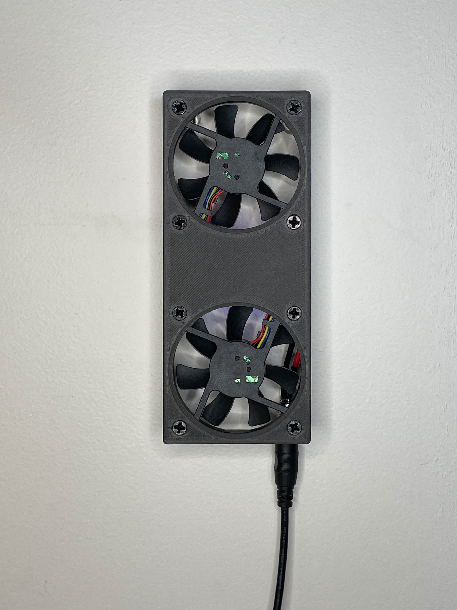

# Remote Breath
Connected fans with sensing and control.
>Made for and tested on:
>- NodeMCU-32S

## Description
Remote Breath in an art piece that connects people across spaces.
It consists of two devices with two fans each.

When someone blows on the bottom fan, the top fan of the other device
starts to spin. When they stop blowing, the other fans stops as well.

If two people are blowing on their fans at the same time, they will feel
the breath from the other as the top fan blows in their face.

